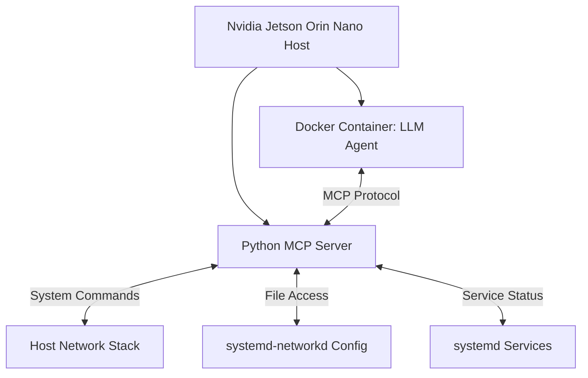
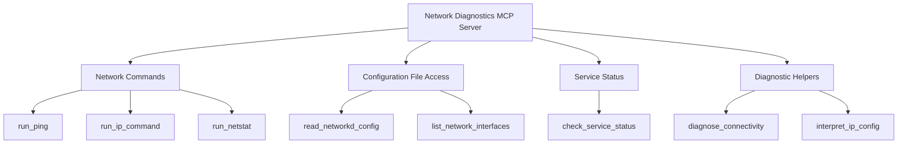

# Network Troubleshooting LLM Agent for Nvidia Jetson Orin Nano

This document outlines the plan for creating a local LLM agent that can assist with network troubleshooting on the Nvidia Jetson Orin Nano, focusing on systemd-networkd.

## Architecture Overview

We'll implement a client-server architecture using the Model Context Protocol (MCP):



### Components:

1. **LLM Agent (Docker Container)**
   - Runs the quantized Sheared-LLaMA-2.7B-ShareGPT model using NanoLLM
   - Communicates with the MCP server to access network diagnostics
   - Provides natural language interface for troubleshooting

2. **Python MCP Server (Host)**
   - Runs on the host system with access to network configuration
   - Exposes network diagnostic tools via MCP protocol
   - Executes commands and interprets results
   - Reads systemd-networkd configuration files
   - Checks service status

## Implementation Plan

### 1. Python MCP Server Development

We'll create a Python-based MCP server that provides the following tools:



#### MCP Tools to Implement:

1. **Network Command Tools**
   - `run_ping`: Ping a host and interpret results
   - `run_ip_command`: Run ip commands (addr, link, route) with interpretation
   - `run_netstat`: Show network connections and statistics

2. **Configuration Tools**
   - `read_networkd_config`: Read and parse systemd-networkd configuration files
   - `list_network_interfaces`: List all network interfaces with their status

3. **Service Tools**
   - `check_service_status`: Check the status of systemd-networkd service

4. **Diagnostic Helper Tools**
   - `diagnose_connectivity`: Run a series of tests to diagnose connectivity issues
   - `interpret_ip_config`: Provide a human-readable interpretation of IP configuration

### 2. LLM Agent Configuration

We'll modify the existing client.py to:

1. Use a more network-focused system prompt
2. Connect to the MCP server
3. Handle tool calls appropriately

### 3. Docker Configuration

We'll configure the Docker container to:

1. Run the NanoLLM with the quantized model
2. Connect to the MCP server on the host
3. Provide a user-friendly interface

## Technical Details

### Python MCP Server

We'll use the Python MCP SDK to create a server that runs on the host system. The server will:

1. Implement the MCP protocol for communication with the LLM
2. Use Python libraries for network operations:
   - `subprocess` for running commands
   - `systemd` Python libraries for service interaction
   - `configparser` or similar for reading configuration files

### Example Tool Implementation

Here's how the `run_ip_command` tool might be implemented:

```python
def run_ip_command(args):
    """Run an ip command and interpret the results"""
    command = args.get('command', 'addr')
    interface = args.get('interface', None)
    
    # Build the command
    cmd = ['ip', command]
    if interface:
        cmd.extend(['show', 'dev', interface])
    
    # Run the command
    result = subprocess.run(cmd, capture_output=True, text=True)
    
    # Parse and interpret the output
    interpretation = interpret_ip_output(result.stdout, command)
    
    return {
        'raw_output': result.stdout,
        'interpretation': interpretation,
        'success': result.returncode == 0,
        'error': result.stderr if result.returncode != 0 else None
    }
```

### LLM Client Modifications

We'll modify the existing client.py to include a network troubleshooting-focused system prompt:

```python
# create the chat history
chat_history = ChatHistory(
    model, 
    system_prompt="""You are a helpful network troubleshooting assistant for Nvidia Jetson devices.
You can help diagnose and fix network issues related to systemd-networkd.
You have access to tools that can run network commands, check configuration files, and verify service status.
Always explain your reasoning and provide clear, step-by-step guidance."""
)
```

## Development Roadmap

### Phase 1: MCP Server Development
1. Set up the Python MCP server structure
2. Implement basic network command tools
3. Implement configuration file access tools
4. Implement service status tools
5. Test the server independently

### Phase 2: LLM Integration
1. Modify the client.py to use a network-focused system prompt
2. Configure the client to connect to the MCP server
3. Test basic tool calls

### Phase 3: Docker Configuration
1. Configure the Docker container to run the LLM
2. Set up networking between the container and host
3. Test the complete system

### Phase 4: Testing and Refinement
1. Test with common network troubleshooting scenarios
2. Refine tool implementations based on testing
3. Improve the system prompt and tool descriptions
4. Document the system and usage instructions

## Deployment Instructions

1. Install the Python MCP server on the host
2. Configure the MCP settings
3. Build and run the Docker container with the LLM
4. Connect to the LLM for network troubleshooting

## Future Enhancements

1. Add more advanced diagnostic tools
2. Implement configuration editing capabilities
3. Add support for other network subsystems beyond systemd-networkd
4. Improve the LLM's knowledge of Nvidia Jetson-specific networking